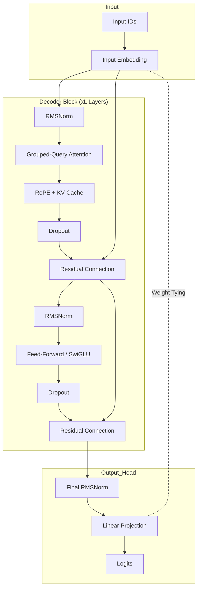

# VectorSLM

VectorSLM is a from-scratch implementation of a decoder-only Transformer architecture, designed as a technical exercise in modern language model design. The project encompasses the entire lifecycle of a Small Language Model (SLM), including custom BPE tokenization, a multi-stage pre-training curriculum, and instruction fine-tuning infrastructure.

## Model Architecture
`model.py`

The implementation adheres to a Llama decoder-only design, incorporating several architectural refinements that depart from the original "Attention Is All You Need" transformer to improve training stability and representational efficiency.

- Pre-Norm residuals: Normalization is applied at the input of each sub-layer rather than the output. This creates a "gradient superhighway" that prevents early signal degradation in deeper networks.
  
- RMSNorm: Replaces standard LayerNorm by normalizing inputs based on their root mean square, which simplifies the computation by removing the mean-centering step without sacrificing performance.
  
- Rotary Positional Embeddings (RoPE): Implements relative position information by rotating the Query and Key vectors in the attention mechanism. This allows the model to better generalize to different sequence lengths compared to absolute learned embeddings
  
- Grouped-Query Attention (GQA) and KV Caching: The attention mechanism supports grouped query-key-value ratios. By using fewer KV heads than query heads, the model reduces the memory footprint of the KV cache during inference, enabling faster generation and larger batch sizes without sacrificing significant performance.
  
- Flash Attention Integration: The attention mechanism utilizes *`torch.nn.functional.scaled_dot_product_attention`*, which dispatches to fused FlashAttention-2 kernels. This minimizes GPU memory I/O by tiling the attention computation, significantly reducing memory overhead for longer sequences.

- SwiGLU Activation: Employs a gated linear unit structure using SiLU activations in the feed-forward blocks for improved representational power.
- Weight Tying: The output projection layer shares the same weight matrix as the input embeddings, reducing total parameter count and improving training efficiency.

The following diagram illustrates the data flow through the model

*Note on Attention Efficiency*: While GQA is the current industry standard for optimizing KV cache memory (as seen in Llama 3), Multi-Head Latent Attention (MLA) has recently emerged as a theoretically more efficient alternative through low-rank compression. GQA was selected for this project to prioritize implementation clarity and alignment with established open-source architectures, though MLA represents a clear direction for further research into context window scaling.

## Tokenizer
`train_tokenizer.py`

The repository includes a standalone BPE tokenizer pipeline built using the tokenizers library.

- Custom BPE Tokenizer: A Byte-Pair Encoding model with a vocabulary size of 16,384.

- Design trade-offs: A relatively small vocabulary size was chosen to minimize the memory footprint of the embedding layers, ensuring parameter allocation is concentrated in the Transformer blocks.

- Training Data: The tokenizer was trained on a balanced subset of 20,000 documents sampled from Cosmopedia, FineWeb-Edu, Tiny-Codes, and DCLM to ensure efficient encoding of both natural language and source code.

## Training & Finetuning 
`train.py` and `finetune.py`

The project implements a complete two-stage pipeline for model development. While the infrastructure is designed for high-throughput training, large-scale execution is currently outside the project's scope due to compute constraints.

### Dataset Selection

The training curriculum utilizes a high-signal dataset mixture to maximize learning efficiency per token: ***Cosmopedia*** and ***FineWeb-Edu*** provide a foundation of high-quality synthetic knowledge and curated educational text for world-modeling, while *DCLM* ensures exposure to diverse web-scale language patterns. ***Tiny-Codes*** is integrated to introduce basic algorithmic reasoning and structural syntax. 

For the fine-tuning stage,  ***SmolTalk*** and ***SlimOrca*** are utilized to transform base completions into conversational dialogue through multi-turn reasoning samples, complemented by *Tulu-3-Code* to refine technical instruction-following. This specific mixture ensures the model is exposed to a wide distribution of structured information, optimizing its ability to handle both natural language and logic tasks within a limited parameter budget.

### Infrastructure

- Pre-training (train.py): Designed for a 3-billion token curriculum using an interleaved streaming approach to handle large-scale datasets with minimal memory overhead. Pretraining utilizes 8-bit AdamW (via bitsandbytes) and a Cosine Annealing learning rate schedule.

- Fine-tuning (finetune.py): Transitions the base model to an instruction-following assistant using a masked loss strategy (ignore_index=-100) so the model only learns to predict assistant responses.

*Note on Compute*: The scripts are fully functional and tested on small subsets of data. Full-scale training of the 3B token curriculum is deferred until specialized hardware becomes available; however, the pipelines are architected to be "drop-in" ready for large-scale clusters.

## Dataset
`dataset.py`

Contains the StreamingLanguageModelDataset, which utilizes PyTorch's IterableDataset to stream tokens directly from the cloud, bypassing the need for massive local storage.

## Design Philosophy
VectorSLM is a small-scale transformer implementation aimed at improving understanding of modern architectural design choices. The project prioritizes clear, readable implementations of core components such as RoPE, GQA, and Pre-Normalization—over benchmark performance, with the goal of making these ideas easier to study and modify.
